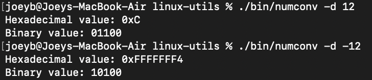
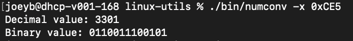

<h1 style="margin: auto; text-align: left;"> Linux Utils </h1>

## What is this for?
I like having certain tools at my fingertips in Linux, this repository allows me to clone it from anywhere and quickly build/install all of what I want onto any Linux or MacOS system.

## Current Features
### numconv
A simple, flexible number converter for general programming uses.
- Decimal to Hex/Binary
- Hexadecimal to Decimal/Binary
- Binary to Decimal/Hex
- RGB to Hex(RGB)
- Hex(RGB) to RGB
##### Images

## Planned features
- sysinfo - one command to list system info (hardware, OS, etc.)
